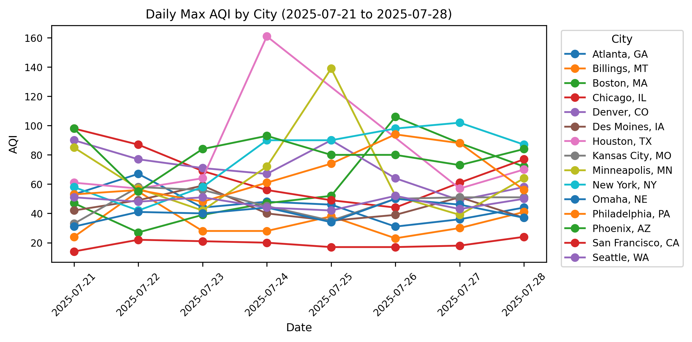
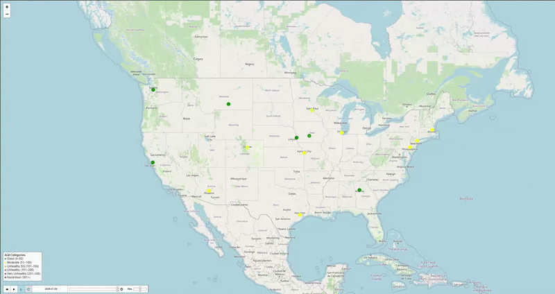

# AQI Explorer

[]()
[]()

Interactive time‑series and map dashboard of U.S. Air Quality Index (AQI) for selected cities, powered by the AirNow API.

---

## Overview

A set of Jupyter notebooks and scripts to:

- Fetch historical AQI data for multiple ZIP codes over a specified date range  
- Aggregate raw pollutant readings into daily maximum AQI per city  
- Generate static time‑series plots using Matplotlib  
- Create interactive Folium maps with a time‑slider and legend overlay  

This project demonstrates an end‑to‑end data pipeline: from API ingestion to interactive visualization.

---

## Tech Stack

- **Python 3.10+**  
- **pandas**, **matplotlib** for data handling and plotting  
- **Folium** (+ plugins) for interactive mapping  
- **requests**, **python‑dotenv** for API requests and secret management  
- **Jupyter Notebook** for exploratory analysis  

---

## Installation

1. **Clone the repository**

    ```bash
    git clone https://github.com/mkuyava42/aqi-explorer.git
    cd aqi-explorer
    ```

2. **Create and activate a virtual environment**

    ```bash
    python3 -m venv venv
    source venv/bin/activate        # macOS/Linux
    .\venv\Scripts\Activate.ps1     # Windows PowerShell
    ```

3. **Install dependencies**

    ```bash
    pip install -r requirements.txt
    ```

---

## Configuration

1. **Obtain an AirNow API key**  
   Sign up at https://www.airnowapi.org to get a free API key.

2. **Create a `.env` file** in the project root:

    ```bash
    echo "AIRNOW_API_KEY=YOUR_API_KEY_HERE" > .env
    ```

---

## Usage

1. **Launch Jupyter Lab**

    ```bash
    jupyter lab
    ```

2. **Open and run**  
   `notebooks/1_data_fetch_and_eda.ipynb`  
   Execute cells in order:

    - **Cell 1**: imports and API key loading  
    - **Cell 2**: city and date definitions  
    - **Cell 3**: fetch raw AQI data  
    - **Cell 4**: inspect raw data  
    - **Cell 5**: aggregate to daily max AQI  
    - **Cell 6**: generate and export time‑series plot  
    - **Cell 7**: save and embed interactive Folium map for latest date  
    - **Cell 8**: create time‑slider map with legend  

---

## Outputs

### Time‑Series Plot  


### Animated AQI Map  


---

## Future Improvements

- **Streamlit/Dash Deployment**: wrap analysis into a web app with date & city selectors  
- **Weather Correlation**: integrate temperature and humidity data for joint analysis  
- **Automated Refresh**: configure GitHub Actions to re‑fetch and rebuild data weekly  
- **Alerting**: send notifications (email/Slack) for days exceeding unhealthy AQI thresholds  

---

## License

This project is licensed under the **MIT License**. See the [LICENSE](LICENSE) file for details.  
